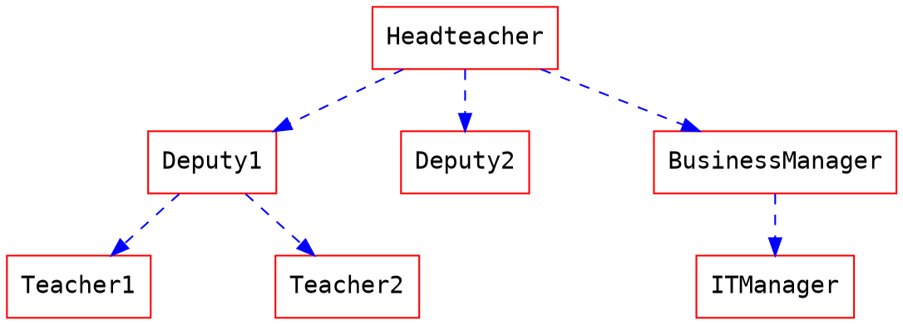
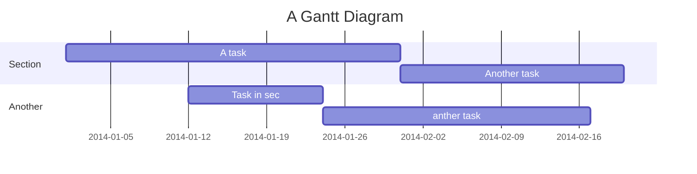

# HackMD 語法練習 \- 20120劉鈞淵

## 1. 標題
\# 符號多少決定字體大小

\# h1
\## h2
\### h3
\#### h4
\##### h5
\###### h6

## 2. 清單
### 無序清單
無序清單用半形星號、加號或減號，再一個空白

例: 考試科目
- 國文
- 英文
- 數學
- 物理
- 化學
- 生物
- 地科

### 有序清單
有序清單用數字、點(或右括號)與空白

例: 作業
1. 國文作文
2. 英文單字
3. 數學公式背誦
4. 寫程式

### 代辦清單
清單後面再加中括號與空白或x(小寫)

例: 周末採購零食
- [ ] 科學麵
- [ ] 鱈魚香絲
- [x] 豆干
- [ ] 舒跑

### 第二層清單
按 Tab 或 2 個空白形成第二層清單

例: 準備考試項目
- 英文
    - 單字
        - 第一課
        - 第二課
    - 作文
    - 巨型
    - 文法
- 數學
    - 公式
    - 方程式

## 3. 字體變化
- 斜體: *一個星號或底線* → \*斜體\*
- 粗體: **兩個星號或底線** → \*\*粗體\*\*
- 刪除線: ~~兩個 Tilde(波浪號)~~ → \~\~刪除線\~\~
- 底線: ++兩個加號++ → \+\+底線\+\+
- 高亮: ==兩個等號== → \=\=高亮\=\=
- 上標: 兩個^，如 1024\^16\^ = 1024^16^ → \^上標\^
- 下標: 兩個~，如 H\~2\~O\~2\~ = H~2~O~2~ → \~下標\~

## 4. Emoji
用兩個冒號夾住，:Emoji 代碼:

:tada: → \:tada\:
:heart: → \:heart\:
:school: → \:school\:
:love_letter: → \:love_letter\:

## 5. 程式碼
- 文字之間使用: 前後用一個倒引號 (\`，與 \~ 同一鍵) 夾住
- 一段獨立指令碼區塊
    - 第一行與最後一行用三個倒引號開頭
    - 第一行倒引號後面可以接程式語言名稱
    - `程式語言名稱=` 則會以語法強調格式呈現 → `python=` 或 `cpp=`
    - `程式語言名稱=開始行號` 行號1由指定行號開始

例: 高一學的第一支 C++ 程式
```cpp=
#include <iostream>

using namespace std;

int main(){
    cout << "Hello, C++" << endl;
    return 0;
}
```

## 6. 連結
`[文字](網址)` 或 `[文字](網址 "提示文字")`
- \[國立北門高中](https://bmsh.tn.edu.tw) → [國立北門高中](https://www.bmsh.tn.edu.tw)
- \[北門高中](https://bmsh.tn.edu.tw "北中") → [北門高中](https://bmsh.tn.edu.tw "北中")

## 7. 圖片
`` 或 `` 或 ``
- !\[新冠病毒](https://i.imgur.com/Bltw7pn.jpg =50%x) →

- !\[](https://i.imgur.com/O7fhBZk.png) →

- !\[](https://hackmd.io/\_uploads/Syvl-aUC3.gif) →


## 8. 外部資源參考


- 資源名稱
    - youtube
    - vimeo
    - gist
    - slideshare
    - speakerdeck
    - pdf

例:
- 沙克男孩

- Rick Astley - Never Gonna Give You Up


### 外部資源範例
- Youtube
    
- Vimeo
    
- Gist
    
- SlideShare
    
- Speakerdeck
    
- PDF
    - **注意: 請使用 https 的網址，否則可能會被您的瀏覽器阻擋載入**
    

## 9. 圖表功能
### MathJax
$$
x = {-b \pm \sqrt{b^2-4ac} \over 2a}
$$

### UML循序圖
```sequence
艾莉絲->包柏: 哈囉，你好嗎？
Note right of 包柏: 包柏思考中
包柏-->艾莉絲: 我很好，謝謝！
Note left of 艾莉絲: 艾莉絲回應
艾莉絲->包柏: 最近過得怎樣？
```

### 流程圖
```flow
st=>start: 開始
e=>end: 結束
op=>operation: 我的操作
op2=>operation: 啦啦啦
cond=>condition: 是或否？

st->op->op2->cond
cond(yes)->e
cond(no)->op2
```

### Graphviz


### Mermaid


### 五線譜
```abc
X:1
T:Speed the Plough
M:4/4
C:Trad.
K:G
|:GABc dedB|dedB dedB|c2ec B2dB|c2A2 A2BA|
GABc dedB|dedB dedB|c2ec B2dB|A2F2 G4:|
|:g2gf gdBd|g2f2 e2d2|c2ec B2dB|c2A2 A2df|
g2gf g2Bd|g2f2 e2d2|c2ec B2dB|A2F2 G4:|
```

## 10. 提示區塊
- 格式
    - 第一行是 `:::` 提示種類
    - 最後一行是 `:::`
- 提示種類
    - success
    - info
    - warning
    - danger
    - spoiler
- 分隔線: 三個或以上的星號、減號、底線
- 區塊引用: >

例:
:::success
綠色區塊: success
:::

:::info
藍色區塊: info
:::

:::warning
黃色區塊: warning
:::

:::danger
紅色區塊: danger
:::

:::spoiler 收合區塊
隱藏資訊: spoiler
:::

---

> 失敗為成功之母